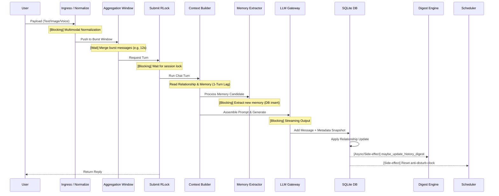
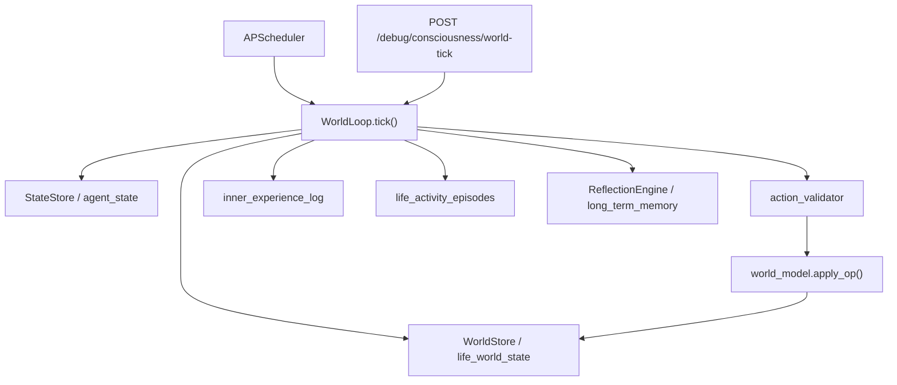

# Neno Runtime Architecture Topology (NENO_ARCHITECTURE.md)

> **WARNING**: This is a Runtime Topology Document. It describes the system exactly as it behaves in production memory and storage. It is not an idealized "Clean Architecture" abstraction. Any modifications to this repository MUST strictly adhere to the runtime contracts defined here.

---

## 1. System Identity

Neno 不是一个轻量级的 LLM Wrapper 脚本，也不是一个典型的无状态微服务集群。

**Neno 是一个高内聚、重防御、单节点状态驱动的“单体智能体引擎”。**

它生存在一个受到严格计算与内存约束的环境（如 1.6GB RAM 单核 VPS）。因此，它演化出了一套极其实用主义的底层架构：
*   **不使用消息队列中间件 (Kafka/RabbitMQ)**：系统手写了进程内的线程锁与队列 (`RLock` / `Event`) 来充当请求漏斗。
*   **不使用外部 KV 缓存 (Redis)**：系统的排队状态放在内存，持久化状态放在单体 SQLite。
*   **以“幸存”为第一要务**：各处布满了 `try/catch` 降级，系统可以容忍局部失忆、阶段不更新、历史不压缩，但绝不允许主对话流宕机。
*   **观测设施即生产设施**：系统没有接入重型 APM (如 Datadog/SkyWalking)，而是通过强硬的 `trace_id` 传递和 `metadata_json` 快照在本地 SQLite 中自建了时光回溯面板。

---

## 2. Runtime Topology (运行时拓扑)

用户消息进入系统后，必须经过一个严格定义的“降维-排队-生成-落盘”流水线。

---

## 3. State Layering Model (状态分层模型)

状态分布极不均匀，且一致性保障机制各异。

| 状态类型 | 状态名称 | 存储位置 | 生命周期 / Ownership | 一致性与崩溃风险 (Failure Risk) |
| :--- | :--- | :--- | :--- | :--- |
| **Persistent** | `messages` | SQLite | 永久保存，只增不改。 | 事务级安全。SQLite 本身是所有逻辑的锚点。 |
| **Persistent** | `memories` | SQLite | 长期保存，允许去重。 | 单点写入。如果提取模型吐出坏 JSON，新状态将被静默丢弃。 |
| **Persistent** | `relationship_state` | SQLite | 持续累加，包含 stage 和 scores。 | `apply_relationship_update` 保障。若失败会回退。 |
| **Persistent** | `agent_state` | SQLite | Neno 的精力、情绪、需求、LifeState 与反思余波。 | `StateStore` 单写者队列负责更新。 |
| **Persistent** | `life_world_state` | SQLite | 房间、物品、模拟时间、金钱、计划和最近行动。 | `WorldStore` 管理单行 JSON；坏 JSON 降级到种子世界。 |
| **Persistent** | `life_activity_episodes` | SQLite | 连续活动片段与当天生活时间线。 | 原子替换 active episode，供反思读取。 |
| **Persistent** | `inner_experience_log` / `dream_reflection_runs` | SQLite | 未表达经历、生活事件与跨天反思审计。 | 失败应降级，不可阻断聊天或世界循环。 |
| **Semi-Persist**| `history_digest.json`| Filesystem | 会随时间更新。属 Token 回收站。 | 纯 JSON I/O。依赖上层 `SubmitLock` 保护免受并发写入。 |
| **Semi-Persist**| `metadata_json` | SQLite (列) | 冻结于生成时刻，永久只读。 | 不允许后续异步补充，以防止破坏回放功能的时间线。 |
| **Runtime** | `Aggregation Queues` | RAM (`dict`) | 寿命仅 `window_seconds`。 | **高风险**：服务器一旦重启，队列瞬间蒸发（Lost Update）。 |
| **Runtime** | `Submit Locks` | RAM (`RLock`) | 会话活跃期存活。 | **高风险**：若发生未被捕捉的底级逃逸异常，引发永久死锁。 |

---

## 3.1 Living World State Boundary

Living World 是与聊天主链并行的持久生活系统，不是聊天 prompt 的附属文本。

**所有权边界：**

- `life_world_state` 保存外部世界事实：地点、物品、模拟时间、金钱、计划和行动历史。
- `agent_state` 保存 Neno 内在事实：精力、情绪、需求、LifeState 和 residue。
- `WorldLoop` 是后端正式融合循环。演示脚本不得成为第二个生产真相源。
- 所有 LLM 产生的 `world_ops` 必须先通过 `action_validator`，再由纯函数
  `world_model.apply_op()` 变更世界。
- 世界循环、世界 LLM 和日计划 LLM 是三个独立开关；仓库示例配置全部关闭。
- 用户消息已经作为 `inner_experience(kind=message)` 进入 Living World，并可作为意图候选交给 `WorldLoop` 处理；
  聊天侧仍不能直接写 `life_world_state`，也不能改变主聊天 prompt 顺序或绕过 Session 串行模型。

具体组件、端点、运行参数与已知缺口见 `docs/living-world.md`。

---

## 4. Queue & Serialization Model (排队与串行模型)

**“External Async, Internal Serialization” (外部异步，内部串行)**。

这是系统能在 SQLite 底座上存活至今的唯一原因。

*   **Burst Merge Window (`SessionAggregationController`)**：用户极有可能连续发 3 条消息。系统不会立即并发处理，而是扔进内存桶，等待 N 秒后合为一个 Ticket 丢进锁。
*   **Strict Session Serialization (`SessionSubmitController`)**：同一 `session_id`，绝对不允许有两个线程同时跑在 `run_chat_turn` 里。
*   **为什么这是承重墙**：SQLite 锁极为脆弱，同时，`history_digest.json` 没有文件级别的强锁。如果剥离了这两个内存网守，并发写入将彻底把整个数据库打穿（database is locked）且覆写所有的 Context 逻辑。

*(⚠️ 崩溃边界：系统如果向 Multi-worker / K8s / 多实例演进，这两个基于内存地址空间的控制器将立刻失效，系统状态一致性会瞬间雪崩。)*

---

## 5. Prompt Infra & Token Economy (上下文与预算基建)

Prompt 的顺序不是代码整洁度决定的，而是由 **Anthropic Cache Economics (大模型缓存经济学)** 决定的。

*   **Cache Prefix Stability**：`SYSTEM_PROMPT` -> `history_digest` 必须死死锁在 Prompt 的最顶部，并打上 `ephemeral` 标记。动态极高的 `time`、`memory` 必须放在底部。
*   **200-Token Update Threshold**：`history_digest` 中的 `baked_text` 不是每说一句话就重算的。只有积攒超过 200 Token 时才会重算。**这是为了极其残酷地维持前置缓存 200 轮不失效的底层黑魔法**。
*   **Monotonic Digest Cursor**：`last_baked_message_id` 单调推进，将 `baked history` (已消化) 和 `raw history` (近期鲜活) 切得干干净净，确保不会产生分叉和重影。

---

## 6. Memory & Relationship Architecture (记忆与关系架构)

*   **Relationship (宏观底色)**：四项积分（familiarity/trust/emotional_depth/boundary）累加表征亲近度（“客气”到“黏人”）。**呈现已连续化**——由分值确定性生成连续短句、并入「此刻的你」动态块，不再读 `prompts/stages/stage_X.txt` 离散模板（`stage` 字段保留作内部/调试用）。
*   **Memory (微观约束)**：提取出具体的偏好和禁忌（“用户讨厌被敷衍”）。
*   **1-Turn Lag (延迟生效法则)**：生成回复时依赖读取状态。而在回复生成**后**才去更新 Relationship 状态（提取新记忆在生成前，但当轮 prompt 不包含新记忆）。任何改变，必须在下一轮（N+1）才能被系统感知。
*   **Priority Override (覆盖法则)**：在 `context_builder` 的动态块中，Memory 排在关系语境的下方。依靠 LLM 的近因效应，具体的 Memory 事实会硬覆盖宏观的关系语调。

---

## 7. Proactive System Topology (主动系统)

主动交互是一个脱离用户直接请求的“旁路 cron 循环”。

*   **The Cooldown Funnel**：硬冷却、日常额度、连续失败熔断、最近聊天避让。层层设卡防骚扰。
*   **The Aggregation Window Blind Spot (隐式竞态盲区)**：
    Proactive Runner 检查 `has_recent_user_message` 时查的是 SQLite。如果此时用户的消息刚发出来 3 秒，正躺在 `SessionAggregationController` 的内存队列里倒计时，SQLite 里是查不到的。
    结果：Proactive 调度器会认为用户没说话，生成主动消息并发出。与用户真实的对话发生错位。这是目前架构中容忍的边界。

---

## 8. Observability Architecture (可观测性架构)

**Debug Infra is Production Infra.**

因为没有外置的 Datadog / ELK，系统的 `debug.py` 是唯一的诊断线。

*   **Metadata Snapshot Freeze**：`metadata_json` 必须在消息产生的同个事务中落库。它就像系统的一张“案发现场照片”，里面保存着当时模型为什么只加载了这 2 条记忆，主动消息因为什么冷却理由被掐断。一旦该结构遭异步污染，`/debug` 的时光回放能力就永久作废。
*   **Trace_ID Propagation**：所有的入口都必须打标并链式传递给每一个下游组件，用于串联所有的 `log_event`。

---

## 9. Fragile Zones & Hazard Map (脆弱区与危险地带)

| 区域 | 等级 | 修改后果 (Silently Break) |
| :--- | :--- | :--- |
| **Session Submit Controllers** | ☢️ **NUCLEAR** | 异步改造或加锁不慎将导致不可恢复的死锁（Deadlock），且应用层日志无报错。 |
| **Context Builder Append Order** | 🚨 **CRITICAL** | 打乱顺序会导致缓存命中率跌至 0，引发 Token Explosion，账单暴涨，但功能测试全部通过。 |
| **History Digest Updater** | 🚨 **CRITICAL** | 改错边界判断条件将造成旧历史永久丢失或永远重复回送。 |
| **Proactive Scheduler Target** | 🔗 **HIGH COUPLING** | 错误放开 QQ-First 的白名单绑定将引起意想不到的跨平台发信洪灾。 |
| **Memory LLM Extractor** | 🟡 **MEDIUM** | JSON 提炼要求改变时，若无重型校验器，LLM 的微小格式变化会导致记忆提取全天候静默失败。 |

---

## 10. Hard Invariants & Hidden Contracts (系统不变量与隐式契约)

*   **Hard Invariant: Strict Session Serialization**：同用户消息必须串行。
*   **Hard Invariant: Text-Only Core Interface**：所有带图 Payload 必须在进核心网前被强制降维成文字。
*   **Hard Invariant: Monotonic Digest Cursor**：消化指针永远只能往高 ID 指。
*   **Hidden Contract: Append Order Coupling**：Prompt 排列顺序必须服务于 Cache API 经济学原理，而非语义可读性。
*   **Hidden Contract: Proactive Blind Spot**：允许系统在特定的极短毫秒级窗口内产生逻辑重影，用作不引重型消息队列的妥协代价。

---

## 11. Failure Philosophy (降级与生存哲学)

**Graceful Degradation > Perfect Consistency (优雅降级优先于完美一致)**。

系统的首要目标是“活着回复用户”。

*   如果关系阶段更新失败，回退返回旧分数状态，继续流转。
*   如果 Digest 使用的 Free 模型限流或无响应，立即切备用模型；如果双重挂掉，记录一次 Critical 事件并跳过本次更新（容忍本次 Prompt 较长），继续流转。
*   如果多模态解析返回错误，将内容记为文本丢弃警告，而不是炸毁整个聊天 Turn。

---

## 12. Future Scaling Boundary (未来扩展边界)

在以下边界条件下，当前设计的“大厦”将迅速崩塌，这是它赖以生存的物理假设：

1.  **Multi-Worker / Multi-Instance Deployment**：一旦 Gunicorn 开启多 Worker 或水平扩展多机节点，`SessionSubmitController` 的内存锁彻底失效，并发消息将直接把 SQLite 的并发写保护击穿。
2.  **External Distributed Queue Introduction**：如果要接入 Kafka/Redis 去解决上述问题，系统将面临 `metadata` 快照时间线对齐的重构灾难。
3.  **No High Rate Content**：系统依赖于正常的聊天频率。若遭到机器级别（100QPS/session）的疯狂攻击，其聚合队列极可能会被撑爆 RAM。
