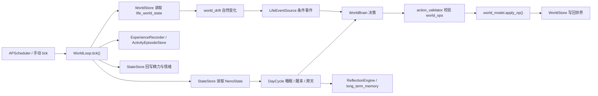

# Neno Living World

> 状态日期：2026-06-19
> 本文是当前 Living World 实现的权威说明。历史规格或实施记录集中在 `docs/archive/`，不代表当前代码状态。
> 刀①「她自己活成自己」的方案/详规在 `docs/dao1-self-developed-life-plan.md`、`docs/dao1-stage12-brief.md`、`docs/dao1-prompt-restructure-brief.md`（实施记录，机制以本文 §5b 为准）。

## 1. 最终目标

Living World 的目标不是生成一串随机事件，也不是让控制台看起来像在生活。

Neno 应在一个持续存在的虚拟现实中生活：

- 世界在没有用户消息时仍持续存在和变化。
- Neno 有空间、物品、时间、精力、情绪、计划、记忆和未完成事务。
- 她的行动消耗时间与资源，并对自己和世界产生可持续后果。
- 后续选择会受到此前经历、长期记忆、情绪余波和现实约束影响。
- 用户消息最终只是进入世界的一类外部事件；Neno 可结合当前生活决定是否回复、何时回复和分几次回复。

当前实现已经形成可运行的世界纵向管道，但还没有达到上述完整验收标准。

## 2. 当前运行结构

`ConsciousnessEngine.start()` 会创建 `WorldLoop`。只有
`CONSCIOUSNESS_WORLD_LOOP_ENABLED=true` 时，才注册常驻 interval job（间隔任务）。
调试端点可以在常驻循环关闭时手动推进一步。

## 3. 组件职责

| 组件 | 职责 |
|---|---|
| `virtual_world.json` | 九个房间（四家内 + 玄关/楼下/便利店/咖啡馆/公园外部场所）、物品、类别和合法状态白名单、邻接图、`shops`（便利店/咖啡馆）|
| `world_model.py` | `WorldDef`、`WorldState`、`WorldOp`（含 `relocate`/`learn`）、动态物品、`obj_room_overrides`/`intent_cursor` 等纯状态变换 |
| `self_facts.py` | 自我库纯逻辑：归纳偏好/学习直接事实的措辞 + 防身份膨胀守门（复用 `self_context` 的传记词表）|
| `world_store.py` | `life_world_state` 单行 JSON 的 SQLite 读写与坏数据降级 |
| `world_drift.py` | 水壶降温、植物缺水等不依赖 Neno 意志的世界变化 |
| `action_validator.py` | 校验位置、对象、状态、预算和创建/销毁权限 |
| `world_brain.py` | 基于世界、内在状态、计划、记忆和事件选择下一行动 |
| `daily_planner.py` | 生成上午、下午和晚间生活意图 |
| `day_cycle.py` | 时段、入睡、醒来、反思、计划跨天继承 |
| `life_events.py` | 从世界状态、时段和内在状态派生低频生活事件 |
| `world_pressure.py` | 压力触发决策引擎：salience/accumulate/should_wake/on_wake/is_hard 纯函数，门控 LLM 调用 |
| `world_loop.py` | 正式融合循环与控制台快照的单一实现入口 |

`WorldLoop` 复用 `ExperienceRecorder`、`ActivityEpisodeStore`、`MemoryRecall`、
`ReflectionEngine` 和 `StateStore`，是生产**唯一**的生活推进模型。
旧 `LifeLoop`/`LifeSimulation` 已退役删除（生产从未挂载，仅一个 debug 预览曾用过）。

## 4. 世界状态

`life_world_state` 保存：

- 当前房间与模拟时间。
- 静态和动态物品状态。
- 金钱、移除物品与 `gone_log`。
- 今日计划与跨天未完成事项。
- 最近行动和最近一次 tick 快照。

初始世界包含：

- 卧室、厨房、客厅、阳台。
- 床、书桌、手机、水壶、杯子、书、植物等 15 个物品。
- 物品状态变化、动态购买、销毁、预算扣减和失去记录。

这是一个可扩展公寓世界，不是通用城市、社会或多智能体模拟器。

## 5. 单次 Tick

正式 `WorldLoop.tick()` 当前按以下顺序执行：

1. 读取世界状态和 Neno 内在状态。
2. 从真实时间（`datetime.now(_TZ8)`，固定 UTC+8）推导世界时钟与时段；不再按 tick 累加模拟分钟。
2b. **精力前置结算**：`energy_dynamics.step_energy` 按真实经过时间积分——醒着掉电、睡着回血，速率受 上一拍动作 / 心情 / 昼夜 调制（`activity/mood/circadian_mult`），单次结算 cap 12h 防停机尖刺，冷启动 `updated_real_ts=None` 不掉电。结算值就地写入内存供本拍判睡醒与快照，并入队持久化（不依赖「submit→read 立刻可见」）。
3. 判断睡眠和醒来——**只看精力阈值**（醒着且 `value<20` 入睡、睡着且 `value>=90` 醒来），作息从精力自然涌现，不再受时段闸门约束；昼夜调制把就寝软锚在夜里。醒来时运行昨日反思并生成新计划；睡眠时 tick 不调 LLM，但精力照常按真实时间回血。
4. 对物品执行自然漂移。
5. 尝试派生生活事件，并把合法事件操作应用到世界。
6. **压力门控**：先收集用户消息 `wishes` 与 queued 主脑命令 `directives`，再把本 tick 事件映射成 salience 种类 → `accumulate` 累积压力 → `should_wake`（用真实秒算 min_gap/预算）。`executive_command=50`，属于 hard event，但仍受 min_gap/预算护栏。三分支：
   - `wake 且 world_llm_enabled` → 真实 LLM 决策 + `on_wake` 清零压力；
   - `world_llm_enabled` 但未唤醒 → 滑行接续（继续上一非瞬态动作，不产生新 ops）；
   - `world_llm_enabled=False` → 确定性 `routine_decide`（行为与门控前一致）。
7. 醒来时把 `wishes`（用户也许想让她做）和 `directives`（Neno 主脑已经拍板）分开交给 `WorldBrain`。只有返回计划的 `decision_source=llm` 才把对应命令标记 consumed；fallback mock 保持 queued 并记录错误。随后校验并应用最多一组 `world_ops`。
8. 写回世界、压力状态、经历、episode、精力和情绪；`last_tick` 记录 `wake/wake_reason/pressure`。
9. 返回控制台快照（世界时钟即真实 UTC+8）。

## 5b. 自我与聊天读取（seed / self_context · 刀①）

让 Neno「自己活成自己」：身份不在聊天 prompt 里写死，而是从世界引擎长出来、聊天只读。

- **种子（`prompts/seed.json`）**：唯一预设、不可变基石。仅 4 键 `name/age/temperament/background_principle`，
  `config.NENO_SEED` 装载。**确定性注入、不经 LLM**——self_context 关闭或未生成时仍可见，她不会因没开功能而现编。
- **self_context（`self_context.py`）**：世界引擎用廉价 LLM（gpt-4o-mini）维护一段「此刻的你」，
  挂在 `world_loop.tick` 尾部（用就地 `ws`/`nstate`）。**双层门控**：显著变化（换房 / 心情跨档 / 换动作 / 睡醒 hard）
  且过最短间隔才重写。只读 种子 + 已落账世界状态 + 内在状态（关系是 chat 侧的，不在此组）。
  存 `life_world_state` 的 `self_context` / `self_context_basis` / `self_context_updated_at`。
  **只读派生，绝不写回自我库。**
- **防伪边界（这一刀的命）**：进 prompt 的「她是谁」只来自 种子 / 已落账状态 / 有世界事件依据的自我事实。
  组写器除 prompt 约束外有**硬码守门 `guard_self_context`**：输出含任何数字、内部字段、或输入里没有的高风险传记词
  （专业/学校/家乡/职业…）→ 拒绝、保留旧值、不推进 basis。做过 ≠ 身份（反复画画推不出「设计专业」）。
- **聊天读取（`self_state_context.py` 三层）**：① 确定性种子（始终）② self_context（空则回退手拼生活状态）
  ③ live 睡醒 + presence。整段放 `messages[last]` 动态区，缓存安全（见 NENO.md §4）。`world_brain` 也读种子+self_context。
- **关系连续化**：`build_relationship_context` 不再读 `prompts/stages/stage_X.txt`，改为按关系分值确定性生成连续短句、
  并入「此刻的你」块；关系打分/积分漏斗模型未变。
- **presence**：睡着仍是唯一物理硬门（睡着 → 攒 `pending_messages`、零 LLM）。醒着后的 reply/defer/leave_unanswered 由统一主脑最终决定，不再由规则或 TRIAGE 截断。

## 5c. 世界动作扩展、自我库结晶与意图通道（刀①收尾）

在 §5b 的「读」之上补「做」与「沉淀」。四块都走现成管道（`action_validator` → `apply_op`、reflection → `long_term_memory`），不另起循环。

- **移动东西（`relocate` op）**：她能把当前房间够得着的物品挪到一步可达的别的房间。静态物品房间可变靠
  `WorldState.obj_room_overrides`（挪回定义房间自动清），动态物品改 `dyn_objects[].room`；`obj_room`/`objects_in_room`
  认覆盖 → `build_snapshot` 自动渲染到新位置（前端零改动）。validator 守 `object_not_here/same_room/not_reachable/room_full`。
- **学习（`learn` op）**：心智动作（`apply_op` 不改物理世界）。`world_loop` 对 accepted learn op 录一条
  `kind="learning"` experience（照 `destroy_object` 派生范式）；reflection `_crystallize_learn_facts` 当天即结晶
  **直接事实**「你最近在学着上手 X」（学习有持续身份意义，单次即可，不必反复）。
- **自我库（`self_facts.py` + reflection）**：`subject="neno"` 的自我事实。两条结晶路——**归纳**：
  `_crystallize_self_facts` 把当天反复活动结晶成偏好「X 像是你常做喜欢的事」；**直接**：上面的学习。
  二者都**写一次去重**（按 `activity:{key}`/`learn:{topic}` 带引号标签 LIKE 定位）、复现强化 salience。
  **防伪写入路径**：只有 reflection 从落账经历能写 `subject="neno"`，聊天写不进；`MemoryRecall.list_self_facts`
  读回 → `self_context._build_facts(self_facts=)` 当 4 号输入 → 由 `world_loop` 在门控开时拉给组写器。
- **意图通道（`intent_cursor` + `world_brain` wishes）**：你的话 → 意图候选 → 世界 LLM 临场决定做不做（无常）。
  **架构铁律**：聊天侧**不写 WorldState**（避免和 `world_loop` 读改写竞争）；`world_loop` 在「真想」分支读
  `intent_cursor` 之后的新 `kind="message"` 经历当 wishes 喂 `world_brain.decide(wishes=)`，喂过推进 cursor。
  world_brain 用无常措辞「对方最近说的（也许想让你做点什么，但你可以不）」暴露——做不做是她的，不是命令。
- **主脑命令通道（`executive_commands` + `world_brain` directives）**：主聊天 Executive 的 `world_intents` 先追加到独立 SQLite 表，聊天侧不碰 `WorldState`。`world_loop` 将 queued 命令作为“你自己的最高执行层已经决定的方向”交给世界脑翻译成当前条件下合法的一步；真实 LLM 未成功接收时不消费，所有物理 op 仍过 validator。
- **买东西店内门控（`create_object`）**：买（`create_object`）现在要求人在 `shops`（便利店/咖啡馆）里，
  validator 加 `not_in_shop`（`shops` 为空的老世界不门控，退回任意房间可买）。不再家里凭空造物——
  去店里买、再 `relocate` 带回家，和移动东西天然组合。`持有`（买进她的 inventory 而非房间）仍未做。

## 5d. 聊天侧统一主脑与多层思考

聊天回合（`turn_orchestrator`）在「读世界状态（§5b）」之上，加一层**真人感判断与表达**。物理睡眠门（presence）仍是最前的硬底。

- **TRIAGE（`selection_layer.py`）**：MiMo + 关深度思考，只给 `{focus,ignore,hooked_by,should_respond,depth,emotion}` 建议。`should_respond` 不再有最终沉默权；失败按 shallow 正常回。
- **深路私有涌念（`inner_deliberation.py`）**：仅 `depth=deep` 时并行跑 approach / boundary / association 三股独立反应。单股失败少一股继续，内容不入用户可见 prompt。
- **最高决策层（`chat_executive.py`）**：主聊天模型读取完整私有状态、TRIAGE、涌念和当前原图，输出 `ExecutiveDecision`：`reply_now | defer | leave_unanswered`、回应点、字数/拍数、高层世界意图和记忆候选。主脑失败默认正常回复，不能无故沉默。
- **隔离出口（`build_executive_output_messages`）**：沿用同一主模型，但只见 system+digest、历史、`voice_self`、裁定后的回应点/上限、当前消息与当前图片；不见原始 self_state / 关系 / 记忆 / 时间，结构上阻断“汇报房间和精力”。出口失败退回旧 prompt。
- **延迟重考虑**：`defer` 才进入 pending；`leave_unanswered` 明确结束且不伪标为 expressed。冷却到期只重新调用主脑，不会绕过它强制生成回复；带图消息从视觉资产归档重新加载原图。
- **决策审计与世界命令**：每次主脑裁决追加到 `executive_decisions`；每条 `world_intent` 作为 queued `executive_commands` 交给 §5c 命令通道。
- **声音自我（`voice_self.py`）**：从她**真实 assistant 回话**蒸馏「她说话的样子」（MiMo 关思考），存 `long_term_memory subject="neno_voice"`
  单条+游标，攒够 `VOICE_SELF_MIN_NEW_REPLIES` 条新回复才刷、**回复后台 daemon thread fire-and-forget** 不阻塞，喂进 `【你说话的调】`。
  风格从她怎么说话长出来，不靠 system 写死。开关 `CHAT_VOICE_SELF_ENABLED`。
- **往事 v1（`time_context_service.build_past_context`）**：距上次 ≥3h → `【往事】` 框成"过去的事、别无缝接旧话题"（零成本、gap 门控）。
  解决跨天对话无时间感。更深的"旧对话→离散带时间记忆事件（b2）"未做。
- **prompt 重构**：`system.txt` 砍成真人感壳（删写死风格、只留底线）；动态区废 `【当前情境】` 大壳，拆成独立标签块、`【对方刚说】` 永远最后
  （见 NENO.md §4）。缓存两断点未动。

## 6. 运行开关

所有可能持续写库或调用模型的能力在示例配置中默认关闭。

| 环境变量 | 默认值 | 作用 |
|---|---:|---|
| `CHAT_SELECTION_LAYER_ENABLED` | `false` | 开启廉价 TRIAGE 建议层 |
| `CHAT_SELECTION_TIMEOUT` | `8` | TRIAGE 与私有涌念单次超时秒数 |
| `CHAT_EXECUTIVE_LAYER_ENABLED` | `false` | 开启主聊天最高决策层与隔离出口 |
| `CHAT_MULTILAYER_THINKING_ENABLED` | 跟随 Executive | deep 时开启三股私有涌念；示例配置显式为 `false` |
| `CHAT_EXECUTIVE_TIMEOUT` | `60` | 主脑裁决超时秒数 |
| `WORLD_PRESENCE_GATE_ENABLED` | `false` | 开启物理睡眠门与 defer pending 消费；需配合常驻 WorldLoop |
| `CONSCIOUSNESS_WORLD_LOOP_ENABLED` | `false` | 注册常驻世界 tick |
| `CONSCIOUSNESS_WORLD_LOOP_INTERVAL` | `8` | 真实秒数间隔 |
| `CONSCIOUSNESS_WORLD_SIM_MIN_PER_TICK` | `30` | **已废弃于时间推进**（世界时钟改真实 UTC+8）；仅 `recent_actions` 的 `ago_min` 仍用 |
| `CONSCIOUSNESS_WORLD_LLM_ENABLED` | `false` | 允许 WorldBrain 调用真实模型（仍受压力门控） |
| `CONSCIOUSNESS_WORLD_PLANNER_ENABLED` | `false` | 允许 DailyPlanner 调用真实模型 |
| `CONSCIOUSNESS_WORLD_PRESSURE_THRESHOLD` | `100` | 压力攒够此值才唤醒 LLM |
| `CONSCIOUSNESS_WORLD_WAKE_MIN_GAP` | `60` | 两次唤醒最小真实秒间隔 |
| `CONSCIOUSNESS_WORLD_WAKE_BUDGET_PER_HOUR` | `12` | 每真实小时唤醒上限（成本护栏，窗口过期自动重置）|
| `CONSCIOUSNESS_WORLD_BOREDOM_DRIP` | `1` | 无事件时每 tick 的压力滴漏 |
| `CONSCIOUSNESS_WORLD_SALIENCE` | 内置表 | 事件→显著度 JSON 覆盖（须覆盖真实 `LifeEvent.kind`）|
| `CONSCIOUSNESS_WORLD_ENERGY_DROP_PER_TICK` | `0.01` | **已废弃于精力推进**：精力改由 `energy_dynamics.step_energy` 按真实时间积分（仿 `SIM_MIN_PER_TICK`）；配置项保留仅为兼容，WorldLoop 不再据它掉电 |
| `OPENROUTER_WORLD_MODEL` | `openai/gpt-4o-mini` | 世界决策与计划模型 |
| `CONSCIOUSNESS_WORLD_LLM_TIMEOUT` | `20` | 世界模型超时秒数 |
| `CONSCIOUSNESS_SELF_CONTEXT_LLM_ENABLED` | `false` | self_context 组写开关（**独立于世界 LLM**；§5b）|
| `CONSCIOUSNESS_SELF_CONTEXT_MIN_INTERVAL` | `600` | self_context 两次重写最短真实秒间隔 |
| `CONSCIOUSNESS_SELF_CONTEXT_MAX_INTERVAL` | `10800` | 超此秒数未刷则强制重组 |
| `OPENROUTER_SELF_CONTEXT_MODEL` | `openai/gpt-4o-mini` | self_context 组写模型 |
| `CONSCIOUSNESS_SELF_CONTEXT_LLM_TIMEOUT` | `20` | self_context 组写超时秒数 |

注意：应用加载 `.env` 后，运行值可能与 shell 中直接实例化配置不同。启动前应通过调试端点确认 `loop_enabled`，不要仅凭代码默认值判断。

**切换 LLM 开关**：用 `scripts/neno-llm.ps1 on|off|status`（改 `.env` 的 LLM/PLANNER + 重启 uvicorn）。
**注意**：该脚本**只管世界 LLM/PLANNER 开关，不含 `CONSCIOUSNESS_SELF_CONTEXT_LLM_ENABLED`**；要开 self_context 须手设 `.env` 该键再重启 uvicorn。开 LLM 时成本由预算护栏钉在约 ¥0.6/天；关时走免费 mock，世界仍持续运行。她的作息由精力阈值自然涌现（累了就睡、睡够就醒），昼夜调制把就寝软锚在夜里；睡眠时不调 LLM，故可让作息完全涌现而无需到点必睡的兜底。

## 7. 调试端点

均要求 admin token（管理令牌）。

| 方法 | 路径 | 行为 |
|---|---|---|
| `GET` | `/debug/consciousness/living-world` | 读取生活状态、经历、反思和长期记忆视图（旧 LifeLoop dry-run 预览已移除）|
| `GET` | `/debug/consciousness/world-live` | 只读新世界快照，不启动写者；额外含 `self` 块（`context`=self_context「此刻的你」/`facts`=自我库 `subject="neno"`/`pending_count`=睡着攒的消息数/`events`=魂事件流，最近在前）|
| `POST` | `/debug/consciousness/world-tick` | 手动执行一次正式 `WorldLoop.tick()` 并写库 |

控制台“生活世界 · 新引擎”面板展示世界时间、房间、物品、精力、情绪、
钱包、计划、事件和最近行动，并新增「魂」层：**此刻的你**（self_context，第二人称正文加引号呈现为她的自我独白）、**她活成的自己**（自我库列表）、
睡着攒消息提示、**魂时刻 feed**（`WorldState.soul_events`：她学了/挪了/买了、或收到你的话——让慢热机制可见，
由 `world_loop` 在自己写 WorldState 时追加，自我事实结晶在读端从记忆派生不进此缓冲）。
前端见 `layout.js` world-story 区 + `consciousness.js` `renderWorldSelf`。`/test` 是重写的“跟随镜头单间”可视化（`worldViewAdapter.js`
+ `world-view.css`），写实房间底图 + 风格化角色精灵，随时段调光；`last_tick.wake=true`
那一拍她头顶冒 💭，标示这是真实 LLM 思考而非滑行 mock。

## 8. 数据表

Living World 直接使用：

- `agent_state`
- `inner_experience_log`
- `dream_reflection_runs`
- `long_term_memory`
- `life_activity_episodes`
- `life_world_state`
- `executive_decisions`
- `executive_commands`

仍保持单机 SQLite，不引入 Redis、外部队列或第二套数据库。

## 9. 当前已知缺口

这些是代码现实，不得在文档或交付中隐藏：

> 双循环已收敛：旧 `LifeLoop`/`LifeSimulation` 与演示脚本 `scripts/world_live_server.py` 已退役删除，
> 生产世界推进为 `WorldLoop` 单一模型，演示可视化由 app 内 `/test` 承担。`source="life_simulation"` 仅作经历来源标签保留。

1. 世界已扩到九房间（含出门外部场所），但实体规则与长期事务深度仍有限——深度靠历史/关系/涌现，不靠堆物品。
2. 确定性 fallback 仍是固定路线；真实 LLM 能增加选择，但不会自动补齐世界规则。
3. `LifeEventSource` 当前按每 tick 概率触发，尚未实现严格的“每日事件上限”。
4. 日计划完成判定主要依赖短文本匹配，长期目标、习惯和未完成事务仍较浅。
5. 用户消息进世界、统一主脑、意图/命令双通道均已落地（见 §5c/§5d）；但“像真人”是连续相处的体感指标，**仍需用户连续跑数日验收**，单元测试只能证明权限、降级和数据流正确。
6. 测试时序 flaky：`test_reflection_engine` 的 c15 已修（加 `_safe_now()` 锚下午 + 显式 target_day，unit 套件稳定全绿）。
   仍待去抖：**`test_wx_session_submit_flow.py`** 系统性时序 flaky（真线程+实时聚合窗、负载敏感）——需给
   `SessionAggregationController` 注入可控时钟，别 piecemeal 调 sleep（放宽默认窗会误伤跨窗测试）。
7. 滑行接续与压力门控只作用于 LLM 开启路径；`world_llm_enabled=False` 的纯 mock 行为保持不变，但 mock 路线本身仍是确定性固定动作。
8. 精力已改真实时间积分、作息改精力阈值涌现（解决「总在睡」「夜里掉不动」两个 P0），单元测试已覆盖纯函数与 tick 集成；但**涌现作息曲线与多日牵挂因果仍待真实运行时长时段验收**（需开后端连续观察就寝相位是否锚夜、不漂移）——代码就绪，体感未实测。

因此，当前可以称为“已接入应用、可持续运行的公寓世界引擎纵向实现”，
不能称为用户目标意义上的完整虚拟生活已经完成。

## 10. 修改红线

- 世界状态进主聊天**只能走 self_context 受控只读通道**（§5b：`build_self_state_context` 读 `life_world_state.self_context`，
  置于 `messages[last]` 动态区、缓存安全、绝不写回）；**禁止在别处手动偷接世界状态、禁止破坏 `context_builder.py` 装配顺序**（见 NENO.md §4）。
- 不绕过 `action_validator` 直接应用 LLM 操作（新 op `relocate`/`learn` 也必须各有一条校验法律）。
- **自我库写入路径**：`subject="neno"` 的自我事实只能由 reflection 从落账经历结晶，聊天/别处写不进（防伪的命）；self_context 只读、绝不写回。
- **意图/命令双通道**：聊天侧**不写 `WorldState`**；用户消息由 `world_loop` 读成可忽略的 `wishes`，主脑 `world_intents` 只能追加到 `executive_commands` 并由 `world_loop` 读成 `directives`。两者最终产生的物理 op 都必须过 validator。
- 不新增并行发送链路；主动发送仍必须走既有 candidate 管道。
- 不让演示脚本成为比正式 `WorldLoop` 更权威的实现。
- 不读取或提交真实 SQLite 数据、`.env`、`.codegraphcontext` 索引。
