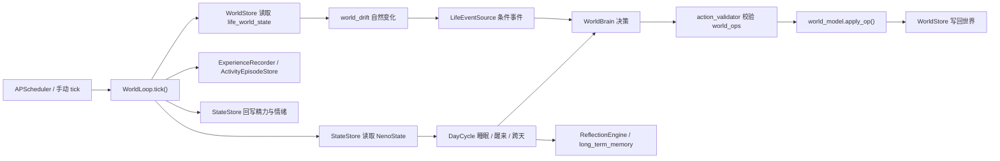

# Neno Living World

> 状态日期：2026-06-07  
> 本文是当前 Living World 实现的权威说明。`PHASE_4*` 和 `docs/superpowers/plans/*` 是历史规格或实施记录，不代表当前代码状态。

## 1. 最终目标

Living World 的目标不是生成一串随机事件，也不是让控制台看起来像在生活。

Neno 应在一个持续存在的虚拟现实中生活：

- 世界在没有用户消息时仍持续存在和变化。
- Neno 有空间、物品、时间、精力、情绪、计划、记忆和未完成事务。
- 她的行动消耗时间与资源，并对自己和世界产生可持续后果。
- 后续选择会受到此前经历、长期记忆、情绪余波和现实约束影响。
- 用户消息最终只是进入世界的一类外部事件；Neno 可结合当前生活决定是否回复、何时回复和分几次回复。

当前实现已经形成可运行的世界纵向管道，但还没有达到上述完整验收标准。

## 2. 当前运行结构

`ConsciousnessEngine.start()` 会创建 `WorldLoop`。只有
`CONSCIOUSNESS_WORLD_LOOP_ENABLED=true` 时，才注册常驻 interval job（间隔任务）。
调试端点可以在常驻循环关闭时手动推进一步。

## 3. 组件职责

| 组件 | 职责 |
|---|---|
| `virtual_world.json` | 四个房间、初始物品、物品类别和合法状态白名单 |
| `world_model.py` | `WorldDef`、`WorldState`、`WorldOp`、动态物品及纯状态变换 |
| `world_store.py` | `life_world_state` 单行 JSON 的 SQLite 读写与坏数据降级 |
| `world_drift.py` | 水壶降温、植物缺水等不依赖 Neno 意志的世界变化 |
| `action_validator.py` | 校验位置、对象、状态、预算和创建/销毁权限 |
| `world_brain.py` | 基于世界、内在状态、计划、记忆和事件选择下一行动 |
| `daily_planner.py` | 生成上午、下午和晚间生活意图 |
| `day_cycle.py` | 时段、入睡、醒来、反思、计划跨天继承 |
| `life_events.py` | 从世界状态、时段和内在状态派生低频生活事件 |
| `world_pressure.py` | 压力触发决策引擎：salience/accumulate/should_wake/on_wake/is_hard 纯函数，门控 LLM 调用 |
| `world_loop.py` | 正式融合循环与控制台快照的单一实现入口 |

旧的 `LifeLoop`、`LifeSimulation` 和 `ActivityEpisodeStore` 仍承担早期生活线与反思输入。
`WorldLoop` 已复用 `ExperienceRecorder`、`ActivityEpisodeStore`、`MemoryRecall`、
`ReflectionEngine` 和 `StateStore`，但两套生活推进模型尚未完全收敛。

## 4. 世界状态

`life_world_state` 保存：

- 当前房间与模拟时间。
- 静态和动态物品状态。
- 金钱、移除物品与 `gone_log`。
- 今日计划与跨天未完成事项。
- 最近行动和最近一次 tick 快照。

初始世界包含：

- 卧室、厨房、客厅、阳台。
- 床、书桌、手机、水壶、杯子、书、植物等 15 个物品。
- 物品状态变化、动态购买、销毁、预算扣减和失去记录。

这是一个可扩展公寓世界，不是通用城市、社会或多智能体模拟器。

## 5. 单次 Tick

正式 `WorldLoop.tick()` 当前按以下顺序执行：

1. 读取世界状态和 Neno 内在状态。
2. 从真实时间（`datetime.now(_TZ8)`，固定 UTC+8）推导世界时钟与时段；不再按 tick 累加模拟分钟。
2b. **精力前置结算**：`energy_dynamics.step_energy` 按真实经过时间积分——醒着掉电、睡着回血，速率受 上一拍动作 / 心情 / 昼夜 调制（`activity/mood/circadian_mult`），单次结算 cap 12h 防停机尖刺，冷启动 `updated_real_ts=None` 不掉电。结算值就地写入内存供本拍判睡醒与快照，并入队持久化（不依赖「submit→read 立刻可见」）。
3. 判断睡眠和醒来——**只看精力阈值**（醒着且 `value<20` 入睡、睡着且 `value>=90` 醒来），作息从精力自然涌现，不再受时段闸门约束；昼夜调制把就寝软锚在夜里。醒来时运行昨日反思并生成新计划；睡眠时 tick 不调 LLM，但精力照常按真实时间回血。
4. 对物品执行自然漂移。
5. 尝试派生生活事件，并把合法事件操作应用到世界。
6. **压力门控**：把本 tick 事件映射成 salience 种类 → `accumulate` 累积压力 → `should_wake`（用真实秒算 min_gap/预算）。三分支：
   - `wake 且 world_llm_enabled` → 真实 LLM 决策 + `on_wake` 清零压力；
   - `world_llm_enabled` 但未唤醒 → 滑行接续（继续上一非瞬态动作，不产生新 ops）；
   - `world_llm_enabled=False` → 确定性 `routine_decide`（行为与门控前一致）。
7. 校验并应用最多一组 `world_ops`。
8. 写回世界、压力状态、经历、episode、精力和情绪；`last_tick` 记录 `wake/wake_reason/pressure`。
9. 返回控制台快照（世界时钟即真实 UTC+8）。

## 6. 运行开关

所有可能持续写库或调用模型的能力在示例配置中默认关闭。

| 环境变量 | 默认值 | 作用 |
|---|---:|---|
| `CONSCIOUSNESS_WORLD_LOOP_ENABLED` | `false` | 注册常驻世界 tick |
| `CONSCIOUSNESS_WORLD_LOOP_INTERVAL` | `8` | 真实秒数间隔 |
| `CONSCIOUSNESS_WORLD_SIM_MIN_PER_TICK` | `30` | **已废弃于时间推进**（世界时钟改真实 UTC+8）；仅 `recent_actions` 的 `ago_min` 仍用 |
| `CONSCIOUSNESS_WORLD_LLM_ENABLED` | `false` | 允许 WorldBrain 调用真实模型（仍受压力门控） |
| `CONSCIOUSNESS_WORLD_PLANNER_ENABLED` | `false` | 允许 DailyPlanner 调用真实模型 |
| `CONSCIOUSNESS_WORLD_PRESSURE_THRESHOLD` | `100` | 压力攒够此值才唤醒 LLM |
| `CONSCIOUSNESS_WORLD_WAKE_MIN_GAP` | `60` | 两次唤醒最小真实秒间隔 |
| `CONSCIOUSNESS_WORLD_WAKE_BUDGET_PER_HOUR` | `12` | 每真实小时唤醒上限（成本护栏，窗口过期自动重置）|
| `CONSCIOUSNESS_WORLD_BOREDOM_DRIP` | `1` | 无事件时每 tick 的压力滴漏 |
| `CONSCIOUSNESS_WORLD_SALIENCE` | 内置表 | 事件→显著度 JSON 覆盖（须覆盖真实 `LifeEvent.kind`）|
| `CONSCIOUSNESS_WORLD_ENERGY_DROP_PER_TICK` | `0.01` | **已废弃于精力推进**：精力改由 `energy_dynamics.step_energy` 按真实时间积分（仿 `SIM_MIN_PER_TICK`）；配置项保留仅为兼容，WorldLoop 不再据它掉电 |
| `OPENROUTER_WORLD_MODEL` | `openai/gpt-4o-mini` | 世界决策与计划模型 |
| `CONSCIOUSNESS_WORLD_LLM_TIMEOUT` | `20` | 世界模型超时秒数 |

注意：应用加载 `.env` 后，运行值可能与 shell 中直接实例化配置不同。启动前应通过调试端点确认 `loop_enabled`，不要仅凭代码默认值判断。

**切换 LLM 开关**：用 `scripts/neno-llm.ps1 on|off|status`（改 `.env` 的 LLM/PLANNER + 重启 uvicorn）。开 LLM 时成本由预算护栏钉在约 ¥0.6/天；关时走免费 mock，世界仍持续运行。她的作息由精力阈值自然涌现（累了就睡、睡够就醒），昼夜调制把就寝软锚在夜里；睡眠时不调 LLM，故可让作息完全涌现而无需到点必睡的兜底。

## 7. 调试端点

均要求 admin token（管理令牌）。

| 方法 | 路径 | 行为 |
|---|---|---|
| `GET` | `/debug/consciousness/living-world` | 读取旧 LifeLoop、经历、反思和长期记忆视图 |
| `GET` | `/debug/consciousness/world-live` | 只读新世界快照，不启动写者 |
| `POST` | `/debug/consciousness/world-tick` | 手动执行一次正式 `WorldLoop.tick()` 并写库 |

控制台“生活世界 · 新引擎”面板展示世界时间、房间、物品、精力、情绪、
钱包、计划、事件和最近行动。`/test` 是重写的“跟随镜头单间”可视化（`worldViewAdapter.js`
+ `world-view.css`），写实房间底图 + 风格化角色精灵，随时段调光；`last_tick.wake=true`
那一拍她头顶冒 💭，标示这是真实 LLM 思考而非滑行 mock。

## 8. 数据表

Living World 直接使用：

- `agent_state`
- `inner_experience_log`
- `dream_reflection_runs`
- `long_term_memory`
- `life_activity_episodes`
- `life_world_state`

仍保持单机 SQLite，不引入 Redis、外部队列或第二套数据库。

## 9. 当前已知缺口

这些是代码现实，不得在文档或交付中隐藏：

1. 世界规模仍是四房间公寓，实体规则与长期事务深度有限。
2. 确定性 fallback 仍是固定路线；真实 LLM 能增加选择，但不会自动补齐世界规则。
3. `LifeEventSource` 当前按每 tick 概率触发，尚未实现严格的“每日事件上限”。
4. `scripts/world_live_server.py` 仍保留独立 tick 逻辑，没有完全复用正式 `WorldLoop`，存在行为分叉风险。
5. 旧 `LifeLoop/LifeSimulation` 与新 `WorldLoop` 并存，状态所有权还需进一步收敛。
6. 日计划完成判定主要依赖短文本匹配，长期目标、习惯和未完成事务仍较浅。
7. 用户消息尚未作为世界事件进入；回复、不回复、延迟和多段回复属于后续 Phase 5。
8. 已知偶发失败：`test_life_loop` / `test_reflection_engine` 中少量旧断言在 UTC+8 凌晨时段因 wallclock 跨天而 flaky（属早期 LifeLoop 遗留，非 WorldLoop 问题）。
9. 滑行接续与压力门控只作用于 LLM 开启路径；`world_llm_enabled=False` 的纯 mock 行为保持不变，但 mock 路线本身仍是确定性固定动作。
10. 精力已改真实时间积分、作息改精力阈值涌现（解决「总在睡」「夜里掉不动」两个 P0），单元测试已覆盖纯函数与 tick 集成；但**涌现作息曲线与多日牵挂因果仍待真实运行时长时段验收**（需开后端连续观察就寝相位是否锚夜、不漂移）——代码就绪，体感未实测。

因此，当前可以称为“已接入应用、可持续运行的公寓世界引擎纵向实现”，
不能称为用户目标意义上的完整虚拟生活已经完成。

## 10. 修改红线

- 不修改主聊天 prompt 或 `context_builder.py` 来偷接世界状态。
- 不绕过 `action_validator` 直接应用 LLM 操作。
- 不新增并行发送链路；主动发送仍必须走既有 candidate 管道。
- 不让演示脚本成为比正式 `WorldLoop` 更权威的实现。
- 不读取或提交真实 SQLite 数据、`.env`、`.codegraphcontext` 索引。
