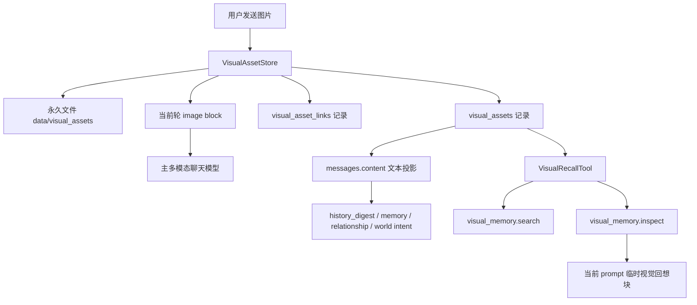

# 永久视觉记忆设计

> 状态：v1 已实现。方向已于 2026-07-07 确认，当前实现覆盖永久归档、当前轮图片块、基础 search/inspect 和单轮私有回想循环。

## 摘要

Neno 应该永久保存用户发来的图片，并在图片刚到来的当前对话轮次里，让主回复模型直接看到原图。历史里的旧图片不应该每次都塞进 prompt，而应该通过一个受控的视觉回想工具，在 Neno 需要时再检索和重看。

新的架构原则是：

> Text-Persistent, Multimodal-Live Turn（持久化文本、当前轮多模态）。

含义是：持久化聊天历史仍然以文本为主，保持 SQLite 和摘要系统安全；但当前这一轮可以携带 image block（图片块）给多模态模型。

## 目标

- 用户发来的图片默认永久保留，除非显式删除。
- 当前轮回复模型能直接看见图片，不再强制先压缩成 caption（图片说明）。
- `messages.content`、history digest、记忆提取、关系更新和世界意图处理仍然只读文本投影。
- Neno 需要回想旧图时，通过工具主动检索和重看。
- 视觉回想必须可观测：有 trace_id、数据库记录和 debug metadata。
- 不破坏 Session 串行化、prompt cache 结构、`WorldLoop` 或 `life_world_state` 所有权。

## 非目标

- v1 不支持视频。
- v1 不把旧图片自动塞进每次历史 prompt。
- 视觉工具不直接写 `life_world_state`。
- SQLite 不保存原始 base64 图片载荷。
- v1 不要求外部对象存储。
- 不做图片生成。

## 现有问题

当前图片路径是：

```text
image attachment
  -> normalize_multimodal_message()
  -> vision model caption
  -> plain text chat turn
```

这个路径安全，但有明显信息损失。主回复模型没有真正看到图片，只看到一段短描述，因此容易丢掉布局、UI 层级、精确空间关系、小字、歧义点，以及“她本人看见了图”的临场感。

## 总体架构



当前轮可以带图片块；持久化历史只存文本投影和稳定资产 metadata（元数据）。

## 数据模型

### `visual_assets`

每个唯一图片哈希对应一条永久资产记录。

```text
id INTEGER PRIMARY KEY AUTOINCREMENT
asset_uid TEXT NOT NULL UNIQUE
sha256 TEXT NOT NULL UNIQUE
mime_type TEXT NOT NULL
storage_path TEXT NOT NULL
byte_size INTEGER NOT NULL
width INTEGER
height INTEGER
source TEXT
original_filename TEXT
created_at DATETIME DEFAULT CURRENT_TIMESTAMP
deleted_at DATETIME
```

规则：

- `storage_path` 使用相对运行根目录的路径，例如 `data/visual_assets/ab/abcdef.png`。
- 图片默认永久保存，不受移动端临时上传清理影响。
- `deleted_at` 用于显式删除后的审计和工具拒绝。

### `visual_asset_links`

把图片资产和消息、会话、trace 关联起来。

```text
id INTEGER PRIMARY KEY AUTOINCREMENT
asset_id INTEGER NOT NULL
message_id INTEGER
session_id TEXT NOT NULL
trace_id TEXT
relation TEXT NOT NULL
created_at DATETIME DEFAULT CURRENT_TIMESTAMP
```

v1 允许的 `relation`：

- `user_sent`
- `current_turn_viewed`
- `recalled`
- `deleted_reference`

### `visual_observations`

缓存工具对某张图片做出的观察结果。

```text
id INTEGER PRIMARY KEY AUTOINCREMENT
asset_id INTEGER NOT NULL
question TEXT NOT NULL
observation TEXT NOT NULL
model TEXT NOT NULL
trace_id TEXT
created_at DATETIME DEFAULT CURRENT_TIMESTAMP
```

这些记录是 append-only（只追加）的观察，不会回写旧消息 metadata，也不会追溯修改历史快照。

## 文件存储

新建永久资产根目录，和临时上传区分开：

```text
data/visual_assets/
  ab/
    abcdef0123....png
```

规则：

- 按 SHA-256 内容哈希存储并去重。
- 后缀根据 MIME type（媒体类型）确定，不信任原始文件名。
- 入库前限制图片大小。
- 校验文件 magic bytes 和 MIME type。
- SQLite 不保存 base64。
- `uploads/mobile/` 继续作为临时上传区；被接受的图片复制或移动进 `data/visual_assets/`。

## 当前轮多模态流程

用户发送图片时：

1. `VisualAssetStore` 校验并归档图片。
2. 生成用于持久化的文本投影：

   ```text
   [用户发送了一张图片]
   用户附带文字：...
   visual_asset_id: vimg_xxx
   ```

3. 保存 user message，内容为文本投影，metadata 里记录 asset id。
4. 构造当前轮 prompt，保持既有缓存安全顺序：

   ```text
   system prompt + digest
   history
   dynamic blocks
   【对方刚说】
   user text
   image block(s)
   ```

5. 通过多模态主回复路径调用模型。
6. 按现有流程保存 assistant 回复。

图片块只出现在最后的动态用户输入里，不进入系统前缀，也不进入历史缓存段。

## 历史图片回想流程

旧图片默认不进 prompt。Neno 需要回想时，通过工具检索和重看。

### 工具一：`visual_memory.search`

输入：

```json
{
  "query": "上次那张报错截图",
  "session_id": "default",
  "limit": 5
}
```

输出：

```json
{
  "candidates": [
    {
      "asset_uid": "vimg_...",
      "message_id": 123,
      "created_at": "2026-07-07T12:30:00",
      "projection": "[用户发送了一张图片] 用户附带文字：...",
      "mime_type": "image/png",
      "width": 1080,
      "height": 2400
    }
  ]
}
```

v1 搜索可以只用消息文本投影、用户附带文字、source、时间和已缓存观察结果。不需要第一版就上 embedding（向量检索）。

### 工具二：`visual_memory.inspect`

输入：

```json
{
  "asset_uid": "vimg_...",
  "question": "这张图里的核心报错是什么？"
}
```

行为：

1. 读取永久图片文件。
2. 带问题调用视觉模型。
3. 把回答写入 `visual_observations`。
4. 把简短观察结果返回给当前轮。

输出：

```json
{
  "asset_uid": "vimg_...",
  "observation": "图里是 Android build 报错，核心是 ...",
  "source": "vision_model"
}
```

## 工具循环

v1 不直接依赖 provider tool calling（模型厂商工具调用），而是做 Neno 自己可控的 tool loop（工具循环）。

建议协议：

```text
<visual_recall>{"query":"上次那张报错截图","question":"核心报错是什么"}</visual_recall>
```

后端行为：

1. 识别私有视觉回想请求。
2. 不把这段内容发给用户，也不入库为 assistant 回复。
3. 调用 `visual_memory.search`。
4. 如果只有一个强候选，调用 `visual_memory.inspect`。
5. 把结果作为临时 `【视觉回想】` 动态块插回当前 prompt。
6. 让模型生成最终用户可见回复。

这样 Neno 看起来像是自己主动想起要看图，但执行权、审计和失败降级都在后端。

## 世界引擎边界

世界引擎只接收文本级事实：

- 用户发了一张图片。
- 用户附带了什么文字。
- 图片文本投影。
- 视觉回想工具给出的观察结果。

世界引擎不直接读图片文件，视觉工具也不写 `life_world_state`。如果视觉观察需要影响未来行为，只能通过现有文本路径进入：message content、memory candidate review（记忆候选审查）或 `inner_experience`。

## Prompt 和缓存规则

保持不变：

- `SYSTEM_PROMPT` 和 `history_digest` 仍然最前。
- 历史消息仍然在动态上下文之前。
- `【对方刚说】` 仍然是最后的动态块。
- 视觉块只出现在缓存历史之后。

新增规则：

- `【对方刚说】` 可以在当前轮携带 image block。
- `【视觉回想】` 只能在工具执行后作为动态块插入。
- 旧图片字节不会自动重放；只有视觉回想工具显式加载时才会进入模型。

## Metadata

user message metadata 建议记录：

```json
{
  "message_type": "image",
  "attachments": [
    {
      "kind": "image",
      "asset_uid": "vimg_...",
      "mime_type": "image/png",
      "byte_size": 123456,
      "sha256": "..."
    }
  ],
  "visual": {
    "archived": true,
    "current_turn_viewed": true,
    "projection_status": "text_only"
  }
}
```

metadata 不保存 base64，也不保存 provider-ready data URL。

## 删除语义

“永久”不是“不可删除”。未来删除命令应当：

1. 设置 `visual_assets.deleted_at`。
2. 删除或隔离物理文件。
3. 保留旧消息的文本记录。
4. 让回想工具返回 `image deleted`。
5. 保留审计能力，但不向用户暴露底层文件错误。

## 配置项

建议新增：

```text
VISUAL_MEMORY_ENABLED=false
VISUAL_ASSET_ROOT=data/visual_assets
VISUAL_MAX_IMAGE_BYTES=8388608
VISUAL_RECALL_ENABLED=false
VISUAL_RECALL_MODEL=<vision model>
VISUAL_RECALL_MAX_CANDIDATES=5
VISUAL_RECALL_TIMEOUT=60
```

默认全部关闭，直到测试通过。

## 可能涉及的代码面

- `app/storage/db.py`：新增视觉资产表。
- `app/schemas.py`：给 `MediaAttachment` 增加可选 `asset_uid`。
- `app/services/visual_asset_store.py`：永久图片归档和 DB 写入。
- `app/services/visual_recall_tool.py`：搜索和重看工具。
- `app/services/chat/llm_gateway.py`：支持主聊天多模态请求。
- `app/services/chat/context_builder.py`：允许最后用户块携带 image block。
- `app/services/chat/turn_orchestrator.py`：传递当前轮视觉资产，并运行视觉回想工具循环。
- `app/routers/chat.py`、`app/routers/platform.py`、`app/services/mobile_api_service.py`：从 caption-only 路线改为先归档、当前轮直看图。
- `app/services/mobile_upload_service.py`：继续保留临时上传区，但不再承担永久保存职责。
- `docs/wx-image-input-route-v1_1.md`：从旧 caption route 更新为永久视觉 route。
- `NENO.md`、`NENO_ARCHITECTURE.md`：把旧 `Text-Only Core Interface` 改成新的持久化/当前轮分层原则。

## 测试

最低测试覆盖：

- 图片会永久保存，并按 SHA-256 去重。
- 移动端临时上传清理不会删除已归档视觉资产。
- `messages.content` 只保存文本投影。
- `metadata_json` 有 `asset_uid`，但没有 base64。
- 当前轮 prompt 在历史之后包含 image block。
- 历史 prompt 不自动包含旧 image block。
- 视觉回想搜索能按消息文本和时间找候选。
- 视觉回想 inspect 能读取永久文件并写入 `visual_observations`。
- 已删除资产不能被 inspect。
- 世界意图路径只收到文本投影。
- 现有 cache structure 测试继续通过。
- 现有 Session Submit / Aggregation 测试继续通过。

## 推进顺序

1. 新增表和 `VisualAssetStore`，暂不改 prompt。
2. 图片进入时先永久归档，但仍保留当前 caption fallback。
3. 当前轮回复切到主模型直接多模态。
4. 增加 `visual_memory.search`。
5. 增加 `visual_memory.inspect`。
6. 增加私有视觉回想工具循环。
7. 更新文档和 debug 视图。

每一步都应可通过配置开关关闭，避免一次性把主链路改穿。

## 风险

- 磁盘可能无限增长。缓解：debug 面板和显式删除流程，而不是自动清理。
- 旧图 inspect 过多会增加模型成本。缓解：工具预算和 `visual_observations` 缓存。
- 图片如果插到历史前面，会破坏 prompt cache。缓解：测试断言 image block 只在最后动态用户输入里。
- 永久图片带来更高隐私风险。缓解：本地存储、DB 不存 base64、支持删除、除必要模型调用外不外传。
- 视觉回想可能选错图。缓解：低置信度时先返回候选，不自动 inspect。

## 结论

采用“永久视觉资产库 + 当前轮直接多模态 + 工具式历史视觉回想”。

旧 caption-only 路线不再作为图片主路径，只保留为主多模态关闭或失败时的 fallback（兜底）。
